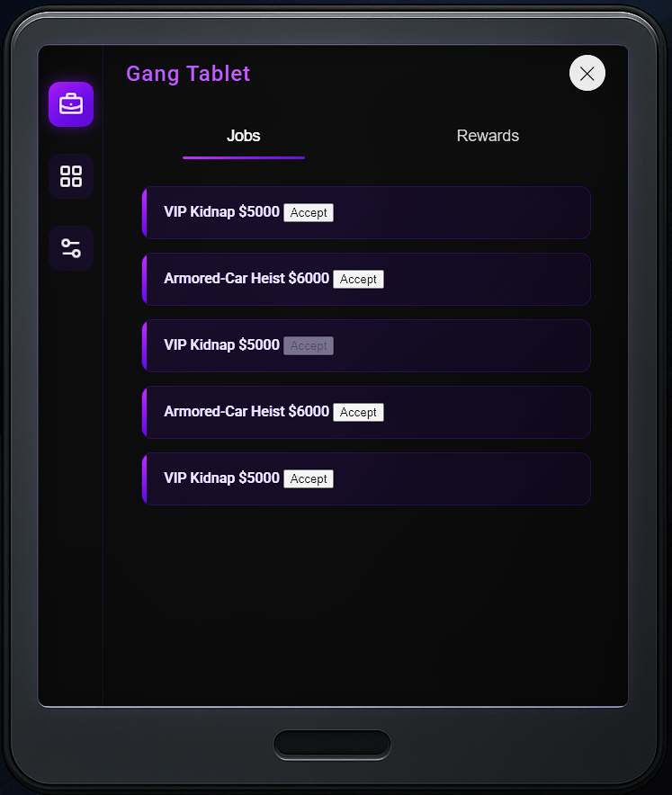

# Gang Tablet – FiveM NUI Job Terminal
## Screenshot

The Gang Tablet is an in-game UI (HTML/CSS/JS) that lets
gang members:

1. **Browse active NPC crime jobs** coming from another resource made by me called `npc_crimes`.
2. **Accept a job** for their gang (first come, first served).
3. **Track rewards** and claim cash when a job is completed.
4. **Customize Tablet** Switch tablet wallpapers, tweak volume (Kinda useless but I think its needed for future implementations.), etc.

---

## Finished Features

| **Job list** | When a player opens the **Jobs** tab the front-end calls an NUICallback `getActiveJobs`. The tablet’s client file triggers `QBCore.Functions.TriggerCallback('npc_crimes:getActiveJobs')` and sends the resulting table back to JS, which renders each job as a row. |

---

## To be done:

| **Accept** | Clicking **Accept** POSTs to `npc_crimes:acceptJobFromTablet`. The server marks the job as taken, removes it from everyone’s list, and triggers `npc_crimes:startJob` only for members of the gang that took it. |
| **Completion** | When the gang fulfils the objective (e.g., cracks the safe) the client fires `npc_crimes:completeJob`. Server pays the reward and emits `npc_crimes:jobCompleted`, which the tablet captures and shows in the **Rewards** tab. |
| **Claim reward** | Player clicks a reward → NUICallback `claimReward` → server deposits the cash via `Player.Functions.AddMoney('cash', amount)`. |

---

## Installation

1. Drop the folder into your resource directory and add to your server.cfg the following:
   ensure gang_tablet

(Also make sure to add a new item to items.lua the item name gotta be gang_tablet)

